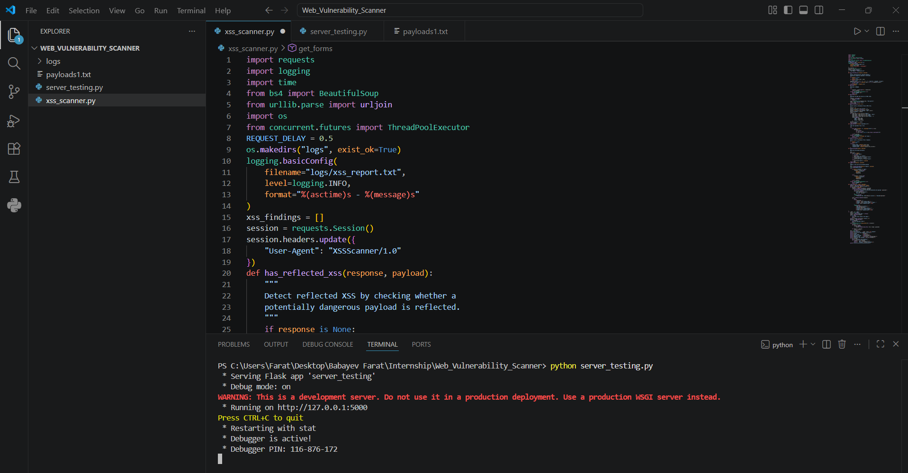
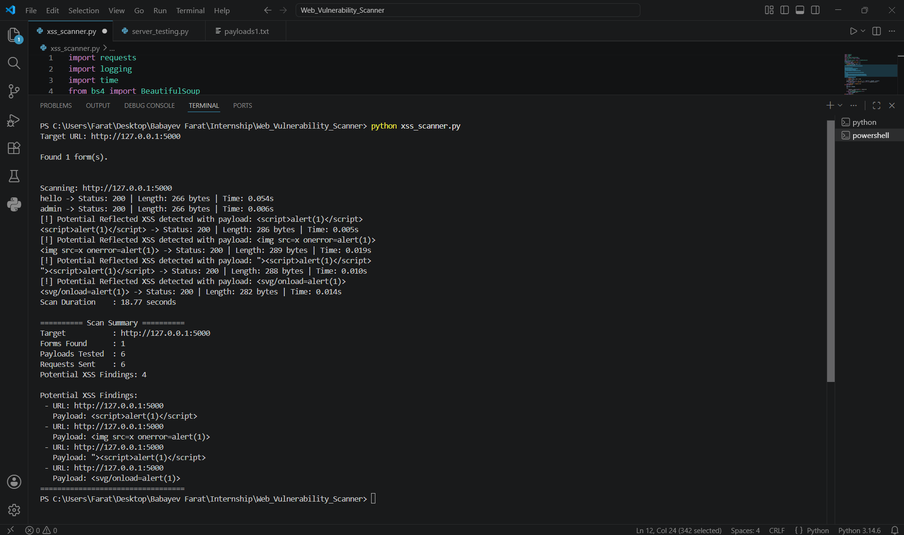

# Web Vulnerability Scanner (Reflected XSS)

## Overview

This project is a Python-based Web Vulnerability Scanner that detects potential reflected Cross-Site Scripting (XSS) vulnerabilities.

The scanner crawls webpages, discovers HTML forms, injects XSS payloads, analyzes responses to determine whether payloads are reflected, and reports potentially vulnerable endpoints.

This project is intended for educational purposes and should only be used on authorized targets.

---

## Features

- Crawl webpages
- Discover HTML forms automatically
- Support GET and POST forms
- Inject XSS payloads into form inputs
- Detect reflected XSS payloads
- Log scan results
- Generate scan summaries
- Basic concurrency using ThreadPoolExecutor
- Rate limiting between requests

---

## Technologies

- Python 3
- requests
- BeautifulSoup4
- concurrent.futures
- logging

---

## Project Structure

```
Web_Vulnerability_Scanner/
│
├── xss_scanner.py
├── payloads1.txt
├── logs/
│   └── xss_report.txt
├── server_testing.py
└── README.md
```

---

## Installation

Install dependencies:

```bash
pip install requests beautifulsoup4 flask
```

---

## Usage

Start the local test server:

```bash
python server_testing.py
```

Run the scanner:

```bash
python xss_scanner.py
```

Enter the target URL:

```
Target URL:
http://127.0.0.1:5000
```

---

## Example Payloads

```
<script>alert(1)</script>

"><script>alert(1)</script>
<svg/onload=alert(1)>
```

---

## Output

The scanner reports:

- Forms discovered
- Payloads tested
- HTTP status codes
- Response length
- Response time
- Potential reflected XSS findings

Results are saved in:

```
logs/xss_report.txt
```


---

## How Detection Works

The scanner submits predefined XSS payloads to each discovered form and checks whether the payload is reflected in the server response.

If a potentially dangerous payload appears unescaped in the returned HTML, the endpoint is reported as a potential reflected XSS vulnerability.

---

## Limitations

This scanner performs basic reflected XSS detection.

It does not currently detect:

- Stored XSS
- DOM-based XSS
- JavaScript execution
- HTML encoding bypasses
- Context-aware payload analysis

As a result, some false positives or false negatives may occur.

---

## Legal Notice

This project is intended for educational purposes only.

Only scan systems that you own or have explicit authorization to test, such as:

- DVWA
- Local Flask applications
- Other intentionally vulnerable web applications